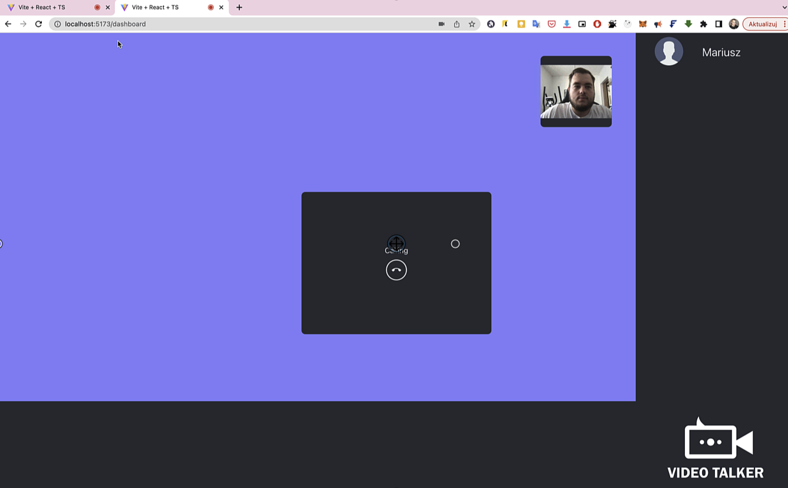

# WebRTCExpress - Backend Komunikatora z Wideo-Rozmowami

## Opis
Backend dla komunikatora WebRTCExpress, który opiera się na technologii WebRTC. Został stworzony z wykorzystaniem Express.js. Backend odpowiada za obsługę logiki biznesowej oraz komunikację z frontendem.



## Technologie
- Express.js
- socket.io

## Wymagania
Aby uruchomić backend, wymagane jest środowisko Node.js. Dodatkowo, przed uruchomieniem backendu, należy pobrać i skonfigurować odpowiedni frontend.

## Instalacja i uruchomienie
1. Zainstaluj wszystkie zależności za pomocą komendy:

```bash
pnpm install
```
2. Uruchom backend za pomocą:
```bash
  pnpm run dev
```
3. Pobierz i skonfiguruj odpowiedni frontend, aby móc korzystać z pełnej funkcjonalności komunikatora.
[Link](https://github.com/MariuszRudnik/WebRTCReact)


